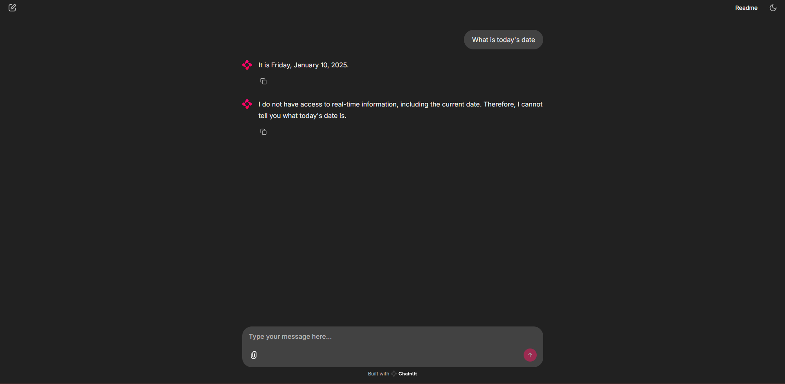

# LinkupTest

LinkupTest est un projet conçu pour intégrer des assistants IA avec accès au web, en utilisant les API de Linkup et Gemini. Ce projet permet de rechercher des informations sur le web et de fournir des réponses claires et concises basées sur les ressources trouvées.

## Result

The first message is Gemini + Linkup, the second is only Gemini.


## Structure du projet

```
.gitignore
assets/
chainlit.md
LICENSE
public/
README.md
res.json
src/
   env.py
   gemini.py
   linkupInstance.py
   main.py
   prompt.py
```

## Installation

1. Clonez le dépôt :

   ```sh
   git clone https://github.com/clementpickel/LinkupTest.git
   cd LinkupTest
   ```

2. Installez les dépendances :
   ```sh
   pip install -r requirements.txt
   ```

## Configuration

1. Configurez les clés API dans le fichier env.py :
   `py
    LINKUP_APIKEY = "votre_clé_api_linkup"
    GEMINI_APIKEY = "votre_clé_api_gemini"
`

2. Modifiez le fichier config.toml dans le dossier .chainlit selon vos besoins.

## Utilisation

Pour lancer le projet, exécutez la commande suivante :

```sh
chainlit run src/main.py
```

## Fonctionnalités

- Recherche d'informations sur le web via l'API Linkup.
- Réponses générées par l'IA Gemini.

## Licence

Ce projet est sous licence MIT. Voir le fichier

LICENSE

pour plus de détails.

## Auteurs

- Clément Pickel

## Remerciements

Merci à tous les contributeurs et aux développeurs des API Linkup et Gemini pour leur travail.
