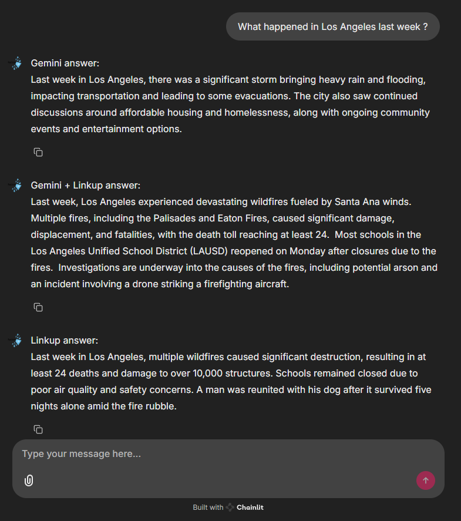

# LinkupTest

LinkupTest est un projet conçu pour intégrer des assistants IA avec accès au web, en utilisant les API de Linkup et Gemini. Ce projet permet de rechercher des informations sur le web et de fournir des réponses claires et concises basées sur les ressources trouvées. Il permet ensuire de comparer les résultats des LLM avec et sans informations ainsi que le LLM de Linkup.

## Result

On peut voir dans cet exemple que Gemini seul est hors-sujet. Gemini avec Linkup donne une réponse satisfaisante. Linkup donne aussi une réponse satisfaisante mais manquant de détails selon moi.


## Structure du projet

```
.gitignore
assets/
chainlit.md
LICENSE
public/
README.md
src/
   env.py
   gemini.py
   linkupInstance.py
   main.py
   prompt.py
```

## Installation

1. Clonez le dépôt :

   ```sh
   git clone https://github.com/clementpickel/LinkupTest.git
   cd LinkupTest
   ```

2. Installez les dépendances :
   ```sh
   pip install -r requirements.txt
   ```

## Configuration

1. Configurez les clés API dans le fichier env.py :
   `py
    LINKUP_APIKEY = "votre_clé_api_linkup"
    GEMINI_APIKEY = "votre_clé_api_gemini"
`
   Vous pouvez générer ces clés à [Linkup](https://app.linkup.so/home) et [Gemini](https://aistudio.google.com/app/apikey).

2. Modifiez le fichier config.toml dans le dossier .chainlit selon vos besoins.

## Utilisation

Pour lancer le projet, exécutez la commande suivante :

```sh
chainlit run src/main.py
```

Vous trouverez ensuite l'application à http://localhost:8000.

## Fonctionnalités

- Recherche d'informations sur le web via l'API Linkup.
- Réponses générées par l'IA Gemini.
- Réponses générées par l'IA Gemini avec les informations fournit par Linkup.
- Réponses générées par l'IA de Linkup.

## Licence

Ce projet est sous licence MIT. Voir le fichier

LICENSE

pour plus de détails.

## Auteurs

- Clément Pickel

## Remerciements

Merci à tous les contributeurs et aux développeurs des API Linkup et Gemini pour leur travail.
